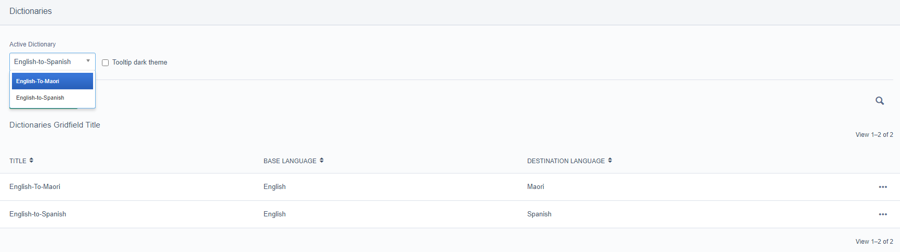

## Overview

This module allows content authors to quickly make translations through the tinyMCE text editor.

Those translations then render on your site with a tooltip displaying their untranslated content. See below:


## Initial configuration

A dictionary object must first be created before this module's features can be used.

Navigate to the 'Dictionary' tab of /admin/settings/ and create at least one dictionary.

Once you have created one (or more) dictionaries, you can now select what dictionary is applied to your site by using the dropdown menu.



Add some word-pairs to your dictionary to get started, here's an example:

- Base word - Hello
- Destination word - Kia ora

It is important here to note the limitations on these word-pairs, a base word must be a single word containing only alphanumeric characters.

In addition to this, duplicate base-words cannot exist within a dictionary.

## In the text editor

With your dictionaries now set-up, we will take a look at how this can be used in the text-editor.

This module provides functionality through a toolbar button and the context menu.


The toolbar button will translate all applicable words within the text editor.

By using the context menu, you are able to translate only selected text.


In addition to this, you are able to add words to any dictionary from the context menu.

## Managing your dictionary

Custom permissions have been provided in order to restrict access to the dictionaries.

The first two permissions cover create/edit/delete access to dictionaries and word-pairs.
The last permission covers view access to dictionaries and word-pairs.

The below screenshot is what is imagined to be a likely configuration for a content-author.


## Additional features

### Dark theme

From within the settings menu, there is a toggleable Dark Theme option. This will apply globally to your site.

 

### Custom theme

A custom theme colour can be selected by inserting a hexcode into _config/config.yml

This hexcode will *not* validate, so an invalid value may break functionality.

The default value for this field is 0 , which will disable the feature when set.

```yml
Signify\TeReoTooltips\SiteTreeExtension:
  custom_hexcode:
    '#D34324'
```
## Usage notes

### What happens when I switch dictionary?

From the settings menu, you can select what dictionary is currently being used to translate words.

When the active dictionary changes, your site will start rendering translations sourced from the new dictionary.

If no translation for a word exists the in the new dictionary, the original untranslated text will be rendered on your site.

This application likes to stay tidy, and as such it will try to remove any translations that it thinks are invalid. If you publish a page with words that no longer have a translation, either due to deleting the word-pair or changing the dictionary, those translations will be removed from the editor.

For this reason, we highly recommend matching your translations across all dictionaries e.g. if your 'English-to-Maori' dictionary contains a translation for 'Hello', then your 'English-to-Spanish' dictionary should also contain a translation for 'Hello'. This allows switching between dictionaries with minimal flow-on-effects and keeps your content tidy.
